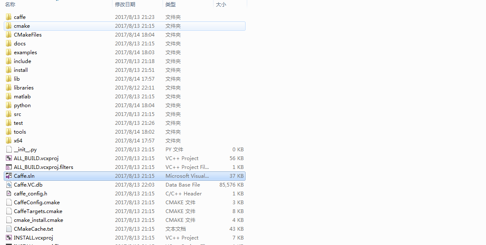
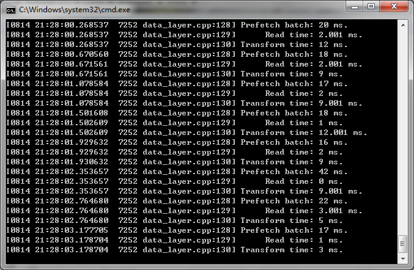

### 系统环境：

windows 7 professional 64位

### 软件环境：

Visual Studio 2015

Cmake 3.4 版本以上

Anconda x64（or Miniconda）

CUDA 7.5 or 8.0(optional)

cuDNN V5(optional)

### 配置Caffe前应保证：

1、上述软件应该保证都被正确安装。如无GPU，可不用安装CUDA或者cuDNN。

2、cmake.exe 和 python.exe已被添加到PATH环境变量。

### 下载依赖库

微软提供的Windows工具包(caffe-master)，这里由于网络问题给出其它下载方式。

#### 直接下载：

[libraries_v140_x64_py27_1.0.1.tar.bz2](<https://github.com/willyd/caffe-builder/releases/download/v1.0.1/libraries_v140_x64_py27_1.0.1.tar.bz2>)，请点击直接下载。

#### 百度网盘下载：

[libraries_v140_x64_py27_1.0.1.tar.bz2](
http://pan.baidu.com/s/1sl6XFRZ)，请点击直接下载。

<!-- more -->

下完依赖包，然后在caffe目录下，新建一个名为“build”的文件夹，然后再把我们下好的依赖包解压到build文件夹里面。解压后的文件到build\\libraries下。

### 编辑build_win.cmd

这里由于电脑没有配置GPU因此修改build_win.cmd里面的CPU_ONLY值为1。

运行该脚本文件可以直接双击，这里采用start
命令启动，出错时可以查看出错信息，方便核对。

### 编译测试

下载[MINIST数据库](
<http://pan.baidu.com/s/1skTIcRb>)，解压提取minist-test-leveldb与minist-train-leveldb文件夹放到..\\caffe\\example\\minist下面，并修改lenet_train_test.prototxt与lenet_solver.prototxt。

将lenet_train_test.prototxt中的data_param参数中的路径修改为绝对路径并将数据格式（backend）修改为LEVELDB格式。

将lenet_solver.prototxt文件中的net修改为绝对路径，将solver_mode修改为cpu(本机采用的无CPU安装)

执行以下命令，如果不会出错，说明安装成功，这里再强调一下一定要修改路径为绝对路径或者将可执行文件添加到环境变量PATH。

> ..\\caffe\\scripts\\build\\tools\\Debug\\caffe-d.exe
> train--solver=D:\\Projects\\caffe\\examples\\mnist\\lenet_solver.prototxt

